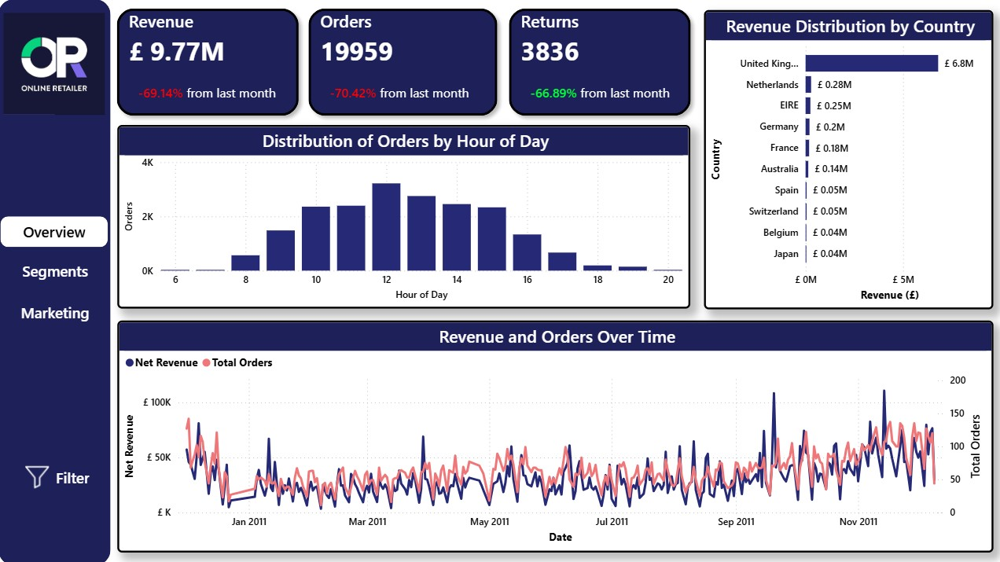
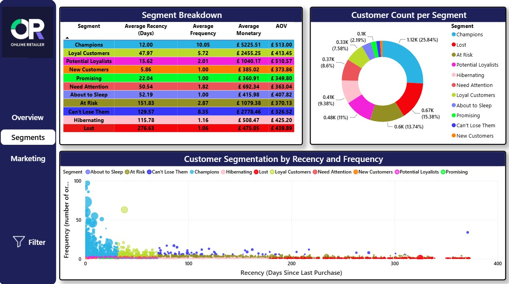
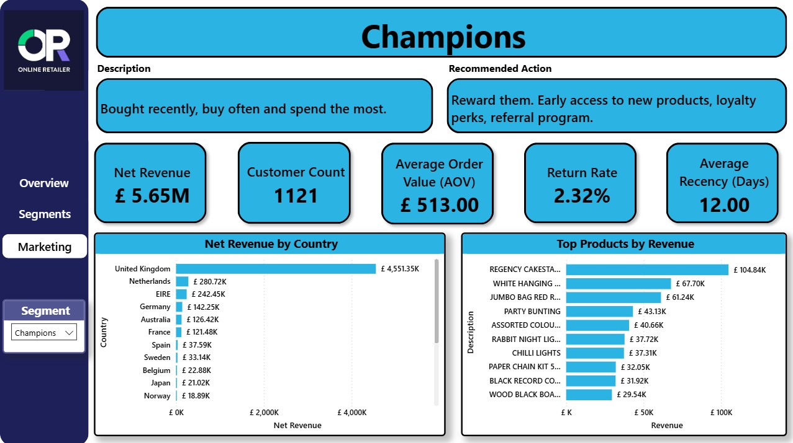

# Customer Segmentation — Online Retail

A UK-based, non-store online retailer sells giftware and homeware to **~4,300 identified customers across 38 countries**. With **~525K transactions** packed into a single trading year, the platform's core commercial challenge is no longer *how much* it sells in aggregate, but segmenting customers into different groups and figuring out **which customers to retain, win back, or grow**.

This project builds a full analytics stack on top of the public [UCI Online Retail dataset](https://archive.ics.uci.edu/dataset/352/online+retail): a Python/pandas pipeline that cleans the raw transaction log, computes **RFM customer segmentation** plus supporting geographic, product, and cohort analyses, validates everything with automated quality checks, and exports a galaxy schema to a Power BI dashboard structured around three business questions. Interact with the full dashboard [here](https://app.powerbi.com/view?r=eyJrIjoiYjQ4MDhiMTgtNmMyNC00YjdiLWE0YjEtOTkxZDQ4ZmM4ODRjIiwidCI6ImM0NjQzM2I0LWJlMjMtNDgxYi05ODkxLTc5Yzk3YTA2MmFlYyJ9).

## Dashboard

**Page 1 — Overview**


**Business question: Is the business healthy, where does revenue come from, and when do customers buy?**

Before looking at individual customers, stakeholders want the top-line vitals: how much the business makes, how that splits geographically, and the rhythm of demand across the day and the year.

**Visuals:**
- **KPI cards**: lifetime **Revenue £9.77M**, **19,959 Orders**, and **3,836 Returns**, each with a month-over-month indicator (−69.14%, −70.42%, and −66.89% respectively; the returns drop is shown green because *fewer returns is good*). The MoM defaults to the **last available month (December) vs. the prior month** — and because the dataset ends only nine days into December, that comparison is deliberately against a partial month. The cards are interactive: slicing to any complete month recomputes the delta against its true previous month.
- **Distribution of Orders by Hour of Day**: a histogram showing demand concentrated in business hours with a clear **midday peak around 12:00**, tailing off after 15:00 — directly useful for timing email sends and flash promotions.
- **Revenue Distribution by Country**: a ranked bar chart where the **United Kingdom (~£6.8M) dwarfs every other market** (Netherlands, EIRE, Germany, France follow far behind). The UK accounts for roughly **85% of revenue**, a concentration risk worth surfacing early.
- **Revenue and Orders Over Time**: a dual-axis daily line chart of Net Revenue and Total Orders across the full period, with the two series tracking closely and building toward the **September–November pre-Christmas peak**.

**Page 2 — Customer Segments**


**Business question: Who are our customers, and how does value concentrate across behavioural segments?**

Every customer is scored on **Recency** (days since last purchase), **Frequency** (number of orders), and **Monetary** value, then assigned to one of **11 behavioural segments** (Champions, Loyal Customers, At Risk, Lost, …). This page shows what defines each segment and how unevenly value is distributed.

**Visuals:**
- **Segment Profiles table**: average recency, frequency, monetary value, and AOV per segment, each row colour-coded by segment. The contrast is stark — **Champions** average 12 days since last purchase, 10 orders, £5,226 spend, and a £513 AOV, while **Lost** customers sit at 277 days and barely over one order.
- **Customer Count per Segment (donut)**: **Champions are 25.8% of customers**, followed by Lost (15.4%), At Risk (13.7%), and Potential Loyalists (11%). Read alongside the profiles table, it makes the value concentration obvious — roughly a quarter of customers (Champions) generate the bulk of revenue, mirroring the Pareto pattern found in EDA (**~26% of customers drive 80% of revenue**).
- **Customer Segmentation by Recency and Frequency (scatter)**: RFM map in which each bubble is a customer, colored by segment. Recent, frequent buyers cluster on the left (low recency, high frequency); the long low-frequency tail stretching right toward 400 days exposes the At-Risk and Lost populations.

Segments are derived in `scripts/rmf_analysis.py`. Each metric is bucketed into quintiles (ranked first to break ties, and log-scaled for the heavily skewed monetary value), then mapped through a Recency × Frequency grid:

```python
df['R_Score'] = pd.qcut(df['Recency'].rank(method='first'), q=5, labels=[5, 4, 3, 2, 1]).astype(int)
df['F_Score'] = pd.qcut(df['Frequency'].rank(method='first'), q=5, labels=[1, 2, 3, 4, 5]).astype(int)
df['M_Score'] = pd.qcut(np.log1p(df['Monetary']).rank('first'), q=5, labels=[1, 2, 3, 4, 5]).astype(int)

def assign_rfm_segment(r, f, m):
    if   r >= 4 and f >= 4: return 'Champions'
    elif r >= 3 and f >= 4: return 'Loyal Customers'
    elif r >= 4 and f >= 2: return 'Potential Loyalists'
    elif r == 5:            return 'New Customers'
    elif r == 4:            return 'Promising'
    elif r == 3 and f >= 2: return 'Need Attention'
    elif r == 3:            return 'About to Sleep'
    elif f == 5:            return "Can't Lose Them"
    elif f >= 3:            return 'At Risk'
    elif r == 2:            return 'Hibernating'
    else:                   return 'Lost'
```

**Page 3 — Marketing Campaign Targeting**


**Business question: For a chosen segment, what is it worth, where are its customers, and how should we target it?**

This is a **selection-driven** page: the user picks one segment from the slicer and every visual reshapes to that audience, turning the segmentation into an actionable campaign brief.

**Visuals (Champions shown):**
- **Segment banner + brief**: the selected segment's name (colour-coded), its **Description** ("Bought recently, buy often and spend the most.") and **Recommended Action** ("Reward them. Early access to new products, loyalty perks, referral program."), all sourced from the `dim_segment` catalogue.
- **KPI cards** for the selected segment: **Net Revenue £5.65M**, **1,121 customers**, **£513 AOV**, **2.32% Return Rate**, and **12-day average recency** — sizing both the audience and the urgency of the campaign.
- **Net Revenue by Country**: where the segment's money is — for Champions, the **UK (£4.55M)** dominates, guiding geo-targeted and localised campaigns.
- **Top Products by Revenue**: what to feature in that segment's emails — Regency Cakestand, White Hanging Heart T-Light Holder, and Jumbo Bag Red Retrospot lead for Champions.

---

## How it works

```
data/raw/Online_Retail.xlsx
        │
        ▼
scripts/data_cleaning.py         # raw -> clean: dedupe, drop price errors, split Sales vs Returns
        │
        ▼
python main.py  orchestrates:
    rmf_analysis.py              # RFM scoring + 11-segment classification
    geographic_analysis.py       # revenue & segment mix by country
    product_analysis.py          # top products per segment
    cohort_analysis.py           # monthly retention cohorts
    galaxy_schema_export.py        # dim_* tables + fact_sales / fact_returns
    quality_checks.py            # automated integrity checks
        │
        ▼
exports/galaxy_schema/*.csv  ─────►  Power BI dashboard
```

The whole pipeline runs from raw data to validated exports with a single command (`python main.py`), finishing with a 28/28 quality-check report (column and row-count checks, sale/return sign rules, FK integrity across the galaxy schema, unique product keys, and a contiguous date table).

---

## Analytical Exports

Pre-computed aggregations that are clearer to build once in pandas than to re-derive in DAX.

| File | Rows | Description |
|---|---|---|
| `customer_rmf.csv` | ~4,300 | RFM metrics, R/F/M scores, and the assigned segment per customer |
| `product_affinity.csv` | ~110 | Top 10 products by revenue for each segment (merchandise only) |
| `segment_by_country.csv` | ~300 | Customer count and revenue per country × segment |
| `country_revenue.csv` | 38 | Revenue, orders, customers, and revenue share per country |
| `cohort_retention_long.csv` | ~150 | Tidy monthly cohort retention (cohort × months-elapsed) |

---

## Galaxy Schema Exports

Fact and dimension tables for interactive filtering and aggregation in Power BI.

| File | Grain | Description |
|---|---|---|
| `fact_sales.csv` | sales line item | Quantity, unit price, revenue, order hour, and date/customer/product keys |
| `fact_returns.csv` | return line item | Returned quantity and value (`C` invoices) stored as positive magnitudes |
| `dim_customer.csv` | unique customer | RFM, segment, AOV, country + short code, cohort month, first/last purchase |
| `dim_product.csv` | stock code | Description and ProductType (Merchandise / Postage & Fees / Gift Voucher) |
| `dim_segment.csv` | segment | Description, recommended action, sort order, and colour hex |
| `dim_date.csv` | calendar date | Year, quarter, month, MonthYear label, day name — contiguous daily calendar |

---

## Tech Stack

Python (Pandas, NumPy), Jupyter, Power BI (DAX).

Exploratory analysis lives in `notebooks/` (data-quality investigation, RFM distributions, and supplementary geographic/product/cohort analysis); the productionised logic lives in `scripts/` and is driven by `main.py`.

---

## Dataset

[UCI Online Retail](https://archive.ics.uci.edu/dataset/352/online+retail): roughly 525K transactions from a UK-based, non-store online gift retailer between December 2010 and December 2011, covering invoices, stock codes, descriptions, quantities, unit prices, customer IDs, and countries.
